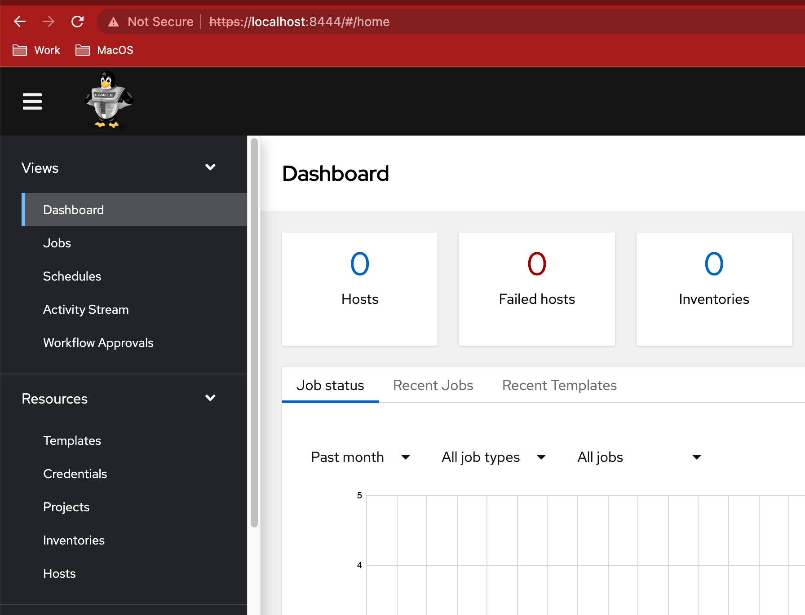

# oci-olamv2-instance
Terraform script for provision Oracle Automation Manager V2

## Requirements

Oracle VPN

Account on tenancy GC35316

Private Key **bastion_GC3_sshkey**

OCI Cli Configured for GC35316

## Step by Step GC3

Summary

1. Connect Oracle VPN
2. Set Oracle Proxy on Terminal
3. Get Bastion Socks5 Proxy
4. Open Bastion Socks5 Proxy
5. Set Bastion Socks5 Proxy on terminal
6. Generate Keys
7. Launch terraform

List of commands

Open one terminal and set Oracle Proxy

`source setProxy.sh oracle`

Get data for create Bastion Socks5 Proxy

`/bin/bash getBastionProxy.sh`

Open second terminal and create bastion proxy with the result

Example output

`ssh -i bastion_GC3_sshkey -o "ProxyCommand=nc -X connect -x www-proxy-ams.nl.oracle.com:80 %h %p"  -N -D 127.0.0.1:20000 -p 22 ocid1.bastionsession.oc1.eu-milan-1.amaaaaaajaynoiyaoihixrgbapndcnd4qtheis5rpggeclteyr66qjq3kglq@host.bastion.eu-milan-1.oci.oraclecloud.com`

In the first terminal, set Bastion Proxy

`source setProxy.sh oracle`

Generate Public/Private key for instance

`/bin/bash generate-keys.sh`

Launch terraform

```
terraform init
terraform apply
```

The output of terraform show you the info to connect the instance and create port forwarding

Example:

```
Apply complete! Resources: 1 added, 0 changed, 0 destroyed.

Outputs:

connection_details = <<EOT

  Create Proxy Socks5: ssh -i bastion_GC3_sshkey -o "ProxyCommand=nc -X connect -x www-proxy-ams.nl.oracle.com:80 %h %p"  -N -D 127.0.0.1:20000 -p 22 ocid1.bastionsession.oc1.eu-milan-1.amaaaaaajaynoiya5fsgoemt5em4gjnvkhvo7u5pnnlszmh7jotvxdx5uuwq@host.bastion.eu-milan-1.oci.oraclecloud.com
  Connect to instance: ssh -i server.key opc@10.0.1.215 -L 8444:127.0.0.2:443 -o ProxyCommand="nc -x 127.0.0.1:20000 %h %p"


EOT
```

Open other terminal and execute "Connect to instance" command

Now you can access to OLAM V2

https://localhosst:8444/

