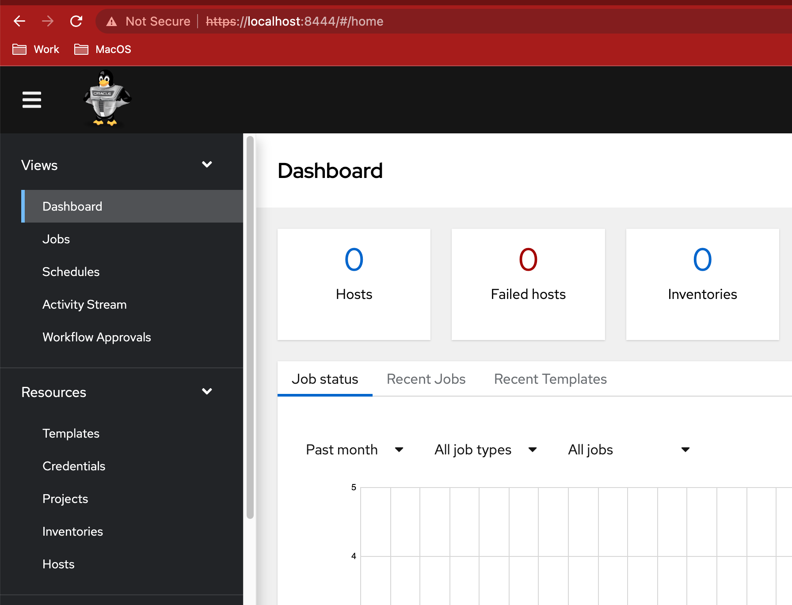

# oci-olamv2-instance

Terraform script for provision Oracle Automation Manager V2

## What is OLAM v2?

Description

https://www.oracle.com/a/ocom/docs/oracle-linux-automation-manager-ds.pdf

License include with Premier Support of Oracle Linux

https://www.oracle.com/a/ocom/docs/linux/value-of-oraclelinux-support.pdf

## Local Requirements

Terraform

OCI Cli Configured for your tenancy

## OCI Requirements

Public subnet with ssh and https connections allowed

## Step by Step

Generate Public/Private key for instance

`/bin/bash generate-keys.sh`


Execute terraform

Modify **region** on terraform.tfvars with your tenancy region
Modify **compartment_ocid** on terraform.tfvars with your compartment on your tenancy
Modify **subnet_vcn_ocid** on terraform.tfvars with your public subnet

```
terraform init
terraform apply
```
20 minutes later...

The output of terraform show you the info to connect the instance

Example:

```
Apply complete! Resources: 1 added, 0 changed, 0 destroyed.

Outputs:

connection_details = <<EOT

  Private IP: XX.XX.XX.XX
  Public IP: XX.XX.XX.XX

EOT
```

Now you can access to OLAM V2

https://<PUBLIC_IP>:443/

User/Password for testing

`admin/Welcome1#`



